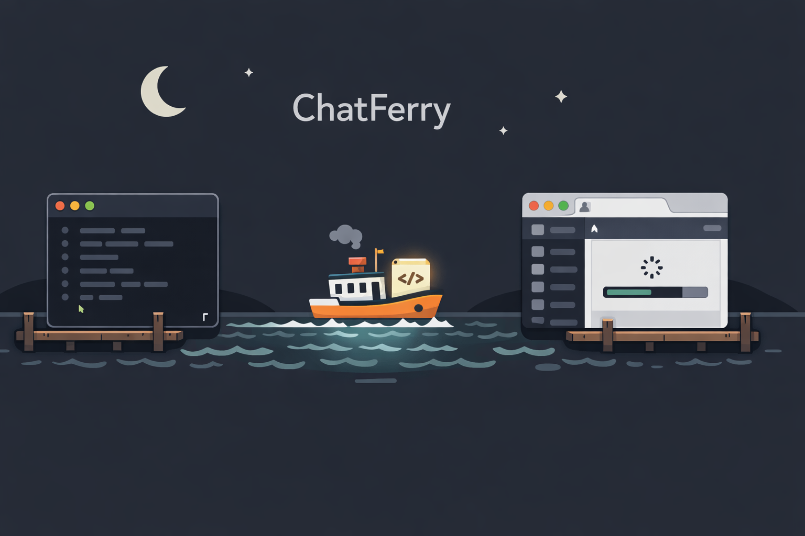

# ChatFerry

<p align="center">
  
</p>

Talk to ChatGPT and Claude from your terminal. No API keys — uses your existing browser sessions.

ChatFerry opens a real Chromium browser, navigates to ChatGPT or Claude, types your prompt, waits for the response, and saves it as a markdown file. It uses persistent browser profiles so you log in once and stay logged in.

## Why

- **No API keys.** Uses your existing ChatGPT Plus / Claude Pro subscription.
- **No per-token costs.** You already pay for it.
- **Real browser sessions.** Not a reverse-engineered API that breaks every week.
- **Markdown exports.** Every response saved as a clean markdown file with frontmatter metadata.
- **Durable async runs.** Fire off a prompt, come back later for the result.
- **Multi-provider.** ChatGPT and Claude through the same CLI.

## Requirements

- Node.js 20+
- A paid ChatGPT and/or Claude account
- A desktop session (the browser window must be visible)

## Install

```bash
npm install -g chatferry
npx playwright install chromium
```

## Setup

Log in to your accounts once:

```bash
chatferry setup
```

This opens ChatGPT in a browser, waits for you to sign in, then repeats for Claude. Your sessions are saved in `~/.chatferry/profiles/` and persist across runs.

Set up a single provider:

```bash
chatferry setup chatgpt
chatferry setup claude
```

## Quick Start

```bash
# List available models
chatferry models chatgpt

# Ask a question and wait for the markdown export
chatferry ask chatgpt "What are the trade-offs of event sourcing?"

# Ask Claude
chatferry ask claude "Review this code" --file src/main.ts

# Fire-and-forget (returns immediately with a run ID)
chatferry ask chatgpt "Deep research on browser automation" --no-wait --json
chatferry wait <run_id> --json
chatferry result <run_id> --json
```

## Commands

| Command | Description |
|---------|-------------|
| `chatferry setup [provider]` | Guided first-run login for one or both providers |
| `chatferry login <provider>` | Open browser for manual login |
| `chatferry models <provider>` | List available models |
| `chatferry ask <provider> [prompt]` | Send a prompt and get the markdown export |
| `chatferry status <run_id>` | Check a run's current state |
| `chatferry wait <run_id>` | Block until a run completes |
| `chatferry result <run_id>` | Get the output path for a completed run |
| `chatferry runs` | List recent runs |
| `chatferry cancel <run_id>` | Cancel a queued or in-flight run |
| `chatferry read <url>` | Extract a full conversation from a private ChatGPT/Claude URL |
| `chatferry reload <file>` | Reopen a saved chat URL and refresh the export |
| `chatferry daemon-status` | Show whether the provider daemon is running |

All commands support `--json` for machine-readable output.

## How It Works

1. **Browser session.** ChatFerry launches Chromium with a persistent profile (shared across providers). You log in once, the cookies persist.
2. **Provider daemon.** When you run `ask`, a background daemon manages the browser. It can run up to 3 concurrent prompts per provider using separate tabs.
3. **Prompt insertion.** Text is inserted using human-like strategies (fill, insertText, clipboard paste) with verification.
4. **Completion detection.** A state machine watches for streaming to stop, thinking indicators to disappear, and the response to stabilize.
5. **Markdown export.** The response HTML is converted to clean markdown via Turndown. A `.meta.json` sidecar stores machine-readable metadata (prompt, response, model, chat URL, content hashes).

## Data Storage

| What | Where |
|------|-------|
| Browser profiles (login sessions) | `~/.chatferry/profiles/` |
| Run records and daemon state | `~/.chatferry/state/` |
| Debug artifacts | `~/.chatferry/debug/` |
| Default output (markdown exports) | Current working directory |

Override the data directory with `CHATFERRY_HOME`:

```bash
CHATFERRY_HOME=/path/to/data chatferry ask chatgpt "hello"
```

## Environment Variables

| Variable | Default | Description |
|----------|---------|-------------|
| `CHATFERRY_HOME` | `~/.chatferry` | Data directory for profiles, state, and debug |
| `CHATFERRY_CHATGPT_CONCURRENCY` | `3` | Max concurrent ChatGPT tabs in the daemon |
| `CHATFERRY_CLAUDE_CONCURRENCY` | `3` | Max concurrent Claude tabs in the daemon |
| `CHATFERRY_DAEMON_IDLE_EXIT_MS` | `60000` | Daemon exits after this many ms of inactivity |

## Selectors

Provider UI elements are mapped via YAML selector configs in `selectors/`. When a provider updates their UI, update the selector file — no code changes needed.

## Important: Personal Use Only

ChatFerry is a personal productivity tool. It automates *your own* browser sessions with accounts *you* pay for. It is **not** designed for:

- Mass automation or scraping
- Circumventing rate limits or usage policies
- Running on behalf of other users
- Any use that violates ChatGPT or Claude terms of service

One person, one browser, your own subscriptions. That's the intended use case.

## Known Limitations

- **Desktop only.** Requires a visible browser window. No headless mode.
- **Provider UI drift.** ChatGPT and Claude change their UIs without notice. Selectors may need updates.
- **One browser at a time.** A file lock prevents concurrent browser access across processes.
- **No conversation threading.** Each `ask` starts a new conversation. No multi-turn support yet.

## Using ChatFerry from AI Agents

ChatFerry ships with a [SKILL.md](SKILL.md) — a structured reference that teaches coding agents (Claude Code, Codex, etc.) how to use the CLI correctly. It covers the full command surface, JSON output shapes, model selection, error handling, and operational patterns.

To use it, point your agent at the skill file:

```bash
# Claude Code — add to your CLAUDE.md or project instructions:
Read SKILL.md before using chatferry.

# Or reference it directly in a prompt:
"Use the chatferry CLI as documented in SKILL.md to submit this prompt to GPT-5.4 Pro."
```

The skill teaches agents to:
- Always use `--json` for machine-readable output
- Discover models with `chatferry models --json` before selecting one
- Use `--no-wait` for long-running prompts and poll with `wait`/`result`
- Read the `.meta.json` sidecar for exact prompt/response data

## Contributing

See [CONTRIBUTING.md](CONTRIBUTING.md).

## Disclaimer

ChatFerry is not affiliated with, endorsed by, or associated with OpenAI or Anthropic. ChatGPT is a trademark of OpenAI. Claude is a trademark of Anthropic.

This tool automates a standard web browser. It does not reverse-engineer, decompile, or access any private APIs. Users are solely responsible for ensuring their use complies with the terms of service of any providers they access through this tool.

THE SOFTWARE IS PROVIDED "AS IS", WITHOUT WARRANTY OF ANY KIND. See [LICENSE](LICENSE) for the full MIT license text.

## License

[MIT](LICENSE)
